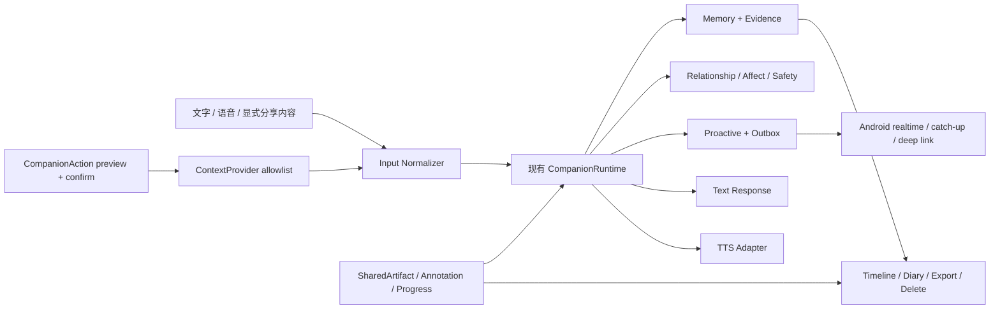

# 栖光 Luminous 开源 AI Companion 生态复调研与下一步功能决策

> 调研日期：2026-08-05  
> 基准清单：[DasterProkio/awesome-ai-companion @ `3208c5a8`](https://github.com/DasterProkio/awesome-ai-companion/blob/3208c5a888ff819cf9fbb9d2e83c754abf721f0d/README.md)  
> 本地基线：`/home/wz/luminous` 当前工作树；只把源码存在视为实现证据，不把 README、fixture 或测试数量视为真实用户闭环证据。  
> 与旧文档的关系：本文替代 [ai_companion_landscape.md](ai_companion_landscape.md) 的“当前开源生态与功能优先级”判断；旧文档仍可作为历史背景。
> 产品决策更新：用户已将“共读优先”调整为受众更广的“共同刷内容（帖子/短视频/长视频）”；当前执行顺序与范围以 [语音存在与共同刷内容拓展计划](../planning/2026-08-05-voice-and-shared-entertainment-expansion-plan.md) 为准。本文中的共读分析仅保留为开源机制参考。

## 1. 结论先行

栖光已经拥有长期记忆、关系/情绪状态、主动决策、提醒、来信、通知、时间线、任务/例行/活动/日记和 Android 常驻触达。下一步不应再横向复制一个“更大的聊天客户端”或再造一套通用记忆/心跳模块，而应该把现有底座转化为用户能直接感到的 **在场** 与 **共同经历**。

如果下一轮只能做一个功能包，选择：

> **语音存在 v1：按住说话 + 可校正转写 + 同一 runtime 回复 + 角色语音留言 + 主动来信语音化。**

如果可以连续做三个功能包，建议顺序是：

1. **语音存在 v1**：先异步语音消息和语音来信，再进入可打断实时通话。
2. **共享内容/共读 v1**：把已有通用 `ActivitySession` 变成第一种真正可持续的共同活动。
3. **受控现实上下文桥**：先接用户显式分享的图片、网页、文档、天气和只读日历；通过窄权限 adapter 接入工具，不做默认常驻监控。

同时把 **记忆证据、人格版本和派生数据删除** 作为以上三个功能包的横向质量门禁，而不是另开一个孤立“记忆 2.0”项目。

明确暂缓：重型 Live2D/VRM、外呼电话、默认常开屏幕/位置/健康感知、通用 MCP 工具市场、多角色广场、抽卡/积分/排行榜、小游戏大全。

## 2. 这次基准实际发生了什么变化

### 2.1 清单规模与结构

当前 awesome 清单去重后包含 **142 个仓库**，没有归档仓库，分布如下：

| 板块 | 仓库数 | 对栖光的意义 |
| --- | ---: | --- |
| Companion Clients & Workspaces | 21 | Android、PWA、桌面载体已非常拥挤；再做通用聊天壳没有差异化 |
| Virtual Phones & Companion Spaces | 11 | 手机壳、房间、朋友圈等视觉包装多，但关系底座质量参差 |
| Background Heartbeats & Proactive Messaging | 15 | 心跳、DND、推送已成为标配；栖光底座已覆盖，继续堆 scheduler 边际价值低 |
| Memory, Identity & Emotion State | 18 | 竞争点从“有没有记忆”转向证据、回滚、叙事整合、情绪权重与可迁移性 |
| Voice, Visual Presence & Embodiment | 21 | 语音和具身是当前最密集的产品前沿之一 |
| Perception | 9 | 语音语气、屏幕、环境信息开始进入伴侣上下文，但隐私边界尚不成熟 |
| Services & Real-World Integrations | 4 | 数量少、杠杆高；容易把伴侣做成通用 agent，必须限制范围 |
| Game Worlds & Agent Toys | 19 | 可提供娱乐，但与栖光“单一长期关系”主线协同较弱 |
| Shared Activities & Media | 17 | 共读、共听、共同任务正在成为“聊天之外的关系材料” |
| Continuity & Data Ownership | 7 | 数量不多，但对长期关系的可持续性和信任极关键 |

清单本身在 2026-07-28 之后的唯一实质性项目更新是加入 Ocean；随后主要是每日 star-history 自动更新。因此，旧判断落后的主要原因不是“清单突然多了几十个项目”，而是 **清单内项目的成熟度、代码开放程度和实现边界发生了变化**。

### 2.2 旧文档中需要修正的判断

1. **Aura 不再适合作为总体产品主参考。** 它的设计方向仍贴近栖光，但当前只有很小的采用信号，README 明确写着语音 I/O、主动 Pulse、动画角色仍在 roadmap。它适合作为简洁的 Android companion 设计样本，不足以承担“最成熟总体参考”。
2. **Miru 是产品概念参考，不是可直接复用的完整开源底座。** 它展示了 AttentionEngine、屏幕节奏、可审计 Markdown 记忆、夜间整理和 Live2D，但 README 明确说明完整后端源码仍在分阶段开放。
3. **AIRI 是具身/实时语音参考，不是长期关系底座参考。** 项目活跃度和工程规模很强，但当前 README 的 roadmap 仍把 memory 标为未完成。
4. **AionsHome 是“功能真实集成”的强证据，但不是理想架构模板。** 它已有 Android 原生录音、WebSocket 前台服务、语音、摄像头、健康设备等大量实现；同时核心 `AionPushService.java` 超过 4,000 行，更适合借鉴设备链路和失败恢复，不适合整体移植。
5. **Ocean 的功能组合很接近下一阶段，但许可证/开放边界需要谨慎。** 它把共读、通知、项目、音乐和 Memory 3.0 串成完整 PWA；仓库自述为 noncommercial source-available，GitHub API 也没有可依赖的 SPDX 许可证，不应直接复制代码到商业产品。
6. **“记忆”和“主动联系”已经从新功能变成基础设施。** 现在更有价值的问题是：记忆能否成为语音、共读和现实上下文中的共同证据；主动联系能否续接真实活动，而不是再多一个随机唤醒公式。

## 3. 栖光当前基线与真正缺口

当前源码已经提供：

- [CompanionRuntime](../../luminous/runtime/application/runtime.py)：同一轮中完成聊天、记忆召回/写入、状态更新、风险判断和主动决策。
- [CompanionService](../../luminous/runtime/application/service.py) 与 [LifeFlowService](../../luminous/runtime/application/life_flow_service.py)：记忆编辑/遗忘/导出、提醒、日历、任务、例行、活动、日记、Today 和 Timeline。
- [Android 客户端说明](../../apps/companion-android/README.md)：本地提醒、前台 WebSocket 实时来信、约 15 分钟后台漏信恢复、`message_id` 去重、重启恢复和受限深链。
- 当前产品 UI 已有记忆检索/修订/忘却、来信、活动、日记和时间线入口。

本次静态核查没有发现可用的 `MediaRecorder`、`getUserMedia`、`speechSynthesis`、ASR/TTS 调用链或语音领域模型；也没有面向用户的图片/文件多模态输入和受控外部工具调用链。`ActivitySession` 是通用生命周期，还没有书籍、段落、批注、阅读进度等共享内容语义。

因此，下一步的主要缺口不是“后端还有没有状态”，而是：

| 已有强资产 | 尚未转化的用户价值 |
| --- | --- |
| Android 通知、outbox、主动决策 | 一封有角色声音、可回放的主动来信 |
| 同一 chat/memory/state/safety runtime | 语音也能保持同一人格、记忆和安全边界 |
| Activity、Reminder、Diary、Timeline | 一起读完一章并留下双方批注、续读点和回顾 |
| 记忆证据、编辑/遗忘、export | 显式共享内容和现实上下文的来源、授权与派生删除 |
| Action preview/confirm | 窄权限、可确认、可审计的外部上下文与工具 adapter |

## 4. 代表仓库深读：学什么，以及不要误学什么

### 4.1 语音与在场

| 仓库 | 已核实能力 | 最值得借鉴 | 限制/风险 |
| --- | --- | --- | --- |
| [AionsHome](https://github.com/death34018-hue/AionsHome) | PWA/Android、原生录音桥、WebRTC VAD、SenseVoice、CosyVoice、前台 WebSocket、摄像头、音乐和健康设备；源码含 [AudioBridge](https://github.com/death34018-hue/AionsHome/blob/main/AionApp/app/src/main/java/com/aion/chat/AudioBridge.java) 与 [AionPushService](https://github.com/death34018-hue/AionsHome/blob/main/AionApp/app/src/main/java/com/aion/chat/AionPushService.java) | Android 音频采集、后台连接、设备恢复和多模态链路是可运行参考 | 功能高度耦合、核心 service 过大；不能把其设备监控默认值带入栖光 |
| [Callhome](https://github.com/Cheiineeey/callhome) | 可运行 STT/语气服务，加上拨号、挂断、DND、未接转语音信箱、通话记录和 iOS push ringing 的参考实现 | [协议](https://github.com/Cheiineeey/callhome/blob/main/docs/PROTOCOL.md)把“能力”与“礼貌约束”一起设计：未接有留言、挂断有缓冲、拒接原因回传 | 是语音通话栈和生产摘录，不是完整 companion；外呼和 iOS 模拟铃声复杂度高，不适合作为首版 |
| [ears](https://github.com/eveacla11/ears) | 转写、语气/声学特征、以用户自身中位数与 MAD 建个人基线、环境声音标签 | 语气应相对“这个用户平时怎样”，不能用全人群固定阈值 | 首版先保证 ASR 和隐私；语气推断是二期增强，不能把低置信特征写成长期事实 |
| [AIRI](https://github.com/moeru-ai/airi) | 大规模活跃的 Live2D/VRM、实时语音和跨端工程 | 未来 avatar/voice adapter 的工程参考 | README 仍将 memory 列为未完成；不应用它反推栖光的关系架构 |
| [Miru](https://github.com/kiyotakali/Miru) | 产品描述包含 AttentionEngine、Live2D、可审计 Markdown 记忆、屏幕摘要和夜间整理 | “截图即刻丢弃、只留理解”“chat 只读记忆、写入来自真实事件”的边界设计 | [README](https://github.com/kiyotakali/Miru/blob/main/README.md#how-it-works)明确完整后端源码尚未全部开放；只能作为产品机制参考 |

判断：**语音已有足够多的独立开源组件和真实集成证据，且能直接复用栖光最强的 runtime 与 Android 触达；它是下一步风险收益比最高的用户功能。**

### 4.2 共享活动与关系材料

| 仓库 | 已核实能力 | 最值得借鉴 | 限制/风险 |
| --- | --- | --- | --- |
| [Ocean](https://github.com/fishwithoctopus/Ocean) | 共读、Web Push、项目、多模型会议、音乐和外置 Memory 3.0；[共读 adapter](https://github.com/fishwithoctopus/Ocean/blob/main/src/adapters/coReading.ts)定义书籍、chunk、progress、annotation、import；[通知服务](https://github.com/fishwithoctopus/Ocean/blob/main/server/notifications.ts)实现 VAPID 与 quiet hours | 共读不是孤立页面，而是通知、记忆和项目空间的一部分 | noncommercial source-available；借产品结构，不复制代码 |
| [coread](https://github.com/meowmana/coread) | EPUB 导入、自适应分页、双方批注、阅读位置、新批注通知、导出；[MCP tools](https://github.com/meowmana/coread/blob/main/lib/mcp-tools.mjs)覆盖读书、加/删批注、目录、导入和进度 | MIT、边界小、数据模型直接，适合做栖光共读 MVP 的代码参考 | 当前规模和使用信号较小；需要补权限、引用证据和完整测试 |
| [co-reading-kit](https://github.com/Youxuuuuu/co-reading-kit) | EPUB/TXT/Markdown 分块、按需读取、长期阅读笔记和进度；README 声明 smoke test 跑完整 MCP 工具链 | 低 token、稳定 chunk、只给模型当前相关片段 | 偏工具包，没有完整双人 UI 和关系闭环 |
| [Duetto](https://github.com/avisforevelyn/Duetto) | WebSocket 同步播放、逐句歌词提问、六条 presence note 汇成歌曲记忆、外部 memory hook | “共享媒体中的指向动作”会自然生成双方共同记忆 | 音乐版权、账户和流媒体集成比本地文本复杂，适合作为共读后的第二种 SharedArtifact |
| [Phosphene](https://github.com/3lmglow/Phosphene) | 任务证据、AI 审核、审计、私有图片清洗、备份恢复、MCP、PWA | 提交证据、审计、幂等、私有图片和恢复流程做得完整 | 积分、扣分、连击和奖励会把关系优化成打卡；栖光只借证据与审计，不借惩罚式留存 |

判断：**共读是栖光最合适的第一项垂直共同活动。** 它能复用现有 Activity/Reminder/Diary/Timeline，还会为语音朗读提供自然场景；相比小游戏、积分或角色广场，它更能产生可持续且可回看的共同经历。

### 4.3 现实上下文、工具与感知

| 仓库 | 已核实能力 | 最值得借鉴 | 限制/风险 |
| --- | --- | --- | --- |
| [Operit](https://github.com/AAswordman/Operit) | 活跃 Android agent，40+ 工具、MCP/Skill、工作流、本地/云 TTS/STT、记忆和 Android 深度集成 | 工具注册、远程 MCP 发现、移动端权限与工作流是成熟工程参考 | 目标是全能 agent；照搬会让栖光从伴侣变成手机自动化工具箱 |
| [OpenCLI](https://github.com/jackwener/OpenCLI) | 将已登录网页、浏览器、Electron app 和本地 CLI 变成确定性接口 | 外部世界 adapter 应是结构化、可审计命令，而不是让模型盲点网页 | 权限面极大；只能通过 allowlist、preview/confirm 和独立授权接入 |
| [gaze](https://github.com/jiangxi1129/gaze) | 指定窗口截图、OCR/字幕、视觉摘要、隐私黑名单、反递归；默认找不到指定窗口时直接 skip | “窄门默认”：授权某窗口不等于可退化为全屏；找不到目标就不采集 | Windows 导向、常驻屏幕感知风险高；先做一次性显式分享 |
| [always-here](https://github.com/Cheiineeey/always-here) | Apple Health、位置、活动、环境音和 Web Push 的方法型方案 | 证明健康/生活上下文能驱动更具体的主动关怀 | 主要是教程/recipe，不是可直接复用的产品；健康推断与通知结合风险最高 |

判断：栖光应该新增一个 **ContextProvider / CompanionAction adapter 层**，但首批只允许低敏、显式输入。不要把“支持 MCP”直接等同于“模型可调用任意工具”。

### 4.4 记忆、人格与连续性

| 仓库 | 已核实能力 | 对栖光仍有价值的增量 | 限制/风险 |
| --- | --- | --- | --- |
| [Memory Constellations](https://github.com/ClaraShafiq/MemoryConstellations) | 事实聚合为主题，再合并成叙事；每条记忆可追溯源对话 | 为共读、语音和活动生成“共同事件叙事”，而不是继续增加平铺事实 | 叙事合并必须保留事实证据，不能让生成摘要取代原文 |
| [Ombre-Brain](https://github.com/P0luz/Ombre-Brain) | 情绪坐标、遗忘/浮现、向量检索、Obsidian Markdown；近期增加来源追踪、结构化导入等 | 情绪显著性、用户可读存储、来源追踪 | README 的 MIT 与新版本 noncommercial notice 并存，复用前必须逐文件核对许可证 |
| [Nocturne Memory](https://github.com/Dataojitori/nocturne_memory) | MCP、结构化图式记忆、可视化和回滚 | 人格/记忆升级快照和 rollback 是比“更多召回”更重要的能力 | “主权人格”叙事不能替代可验证的记忆质量评测 |
| [Aelios](https://github.com/wusaki0723/Aelios) | 即时捕获、周期抽取、夜间整理、六层记忆与三闸召回 | 后台整合节奏和分层 curation | 栖光已有 L0-L4 consolidation；不值得整体替换，只借评测和运营面板思路 |
| [dylan-heartbeat](https://github.com/callie0313/dylan-heartbeat) | 时间线、Bark/ntfy、天气、日记、静默/推送决策 | 主动行为本身写回共同时间线；“没发消息”也可以是连续性状态 | 栖光已有更强 DND/outbox/feedback；不再复制它的 gateway |

判断：栖光无需更换记忆底座。应该把现有证据链扩展到新媒介，并增加 **人格/记忆版本快照、派生数据删除、共同事件叙事** 三项纵向能力。

## 5. 功能优先级评分

评分是相对决策工具，不是市场规模预测。权重为：长期陪伴差异化 30%、复用当前底座 25%、外部实现证据 20%、隐私/安全可控性 15%、实现成本 10%。每项 1–5 分，成本项为“越容易越高”。

| 候选功能 | 差异化 | 底座复用 | 实现证据 | 可控性 | 成本友好 | 加权分 | 决策 |
| --- | ---: | ---: | ---: | ---: | ---: | ---: | --- |
| 异步语音 + 语音来信 | 5 | 5 | 5 | 4 | 3 | **4.65** | 下一项功能 |
| 共读 + SharedArtifact | 5 | 5 | 4 | 5 | 3 | **4.60** | 紧随语音 |
| 记忆/人格版本与共同事件 | 5 | 5 | 4 | 5 | 4 | **4.70** | 横向门禁，不单独拖慢用户功能 |
| 显式分享图片/网页/文档 | 4 | 4 | 4 | 4 | 3 | **3.90** | 第三阶段 |
| 天气 + 只读日历 connector | 3 | 4 | 5 | 4 | 4 | **3.90** | 与第三阶段一起做 |
| 可打断实时语音通话 | 5 | 4 | 4 | 3 | 1 | **3.85** | 语音 v2 |
| 轻量 2D/Live2D 身体 | 3 | 3 | 5 | 4 | 2 | **3.45** | 语音和共读验证后 |
| 通用 MCP/工具市场 | 2 | 3 | 5 | 1 | 2 | **2.70** | 不做用户主功能，只做窄 adapter |
| 常驻屏幕/位置/健康感知 | 4 | 3 | 3 | 1 | 2 | **2.90** | 暂缓 |
| 多角色、角色市场、小游戏大全 | 2 | 2 | 4 | 3 | 2 | **2.55** | 与当前产品定位不符 |

人格/记忆版本项分数最高，但它主要是长期质量与信任基础，不足以单独构成下一轮用户可感知的新品类。因此产品交付顺序仍以语音为先，同时把该项嵌入每个里程碑。

## 6. 推荐实施方案

### M1：语音存在 v1

#### 用户闭环

1. 用户按住说话或选择一段音频。
2. ASR 返回转写；用户可在发送前校正。
3. 校正后的文本进入现有 `CompanionRuntime.chat`，复用相同 persona、memory、state、safety 和 trace。
4. 回复同时生成文本与角色语音；任何一条主动来信也可以携带可选语音附件。
5. 转写、原音频、合成音频分别可删除；默认不把声纹、语气推断写入长期记忆。

#### 工程边界

- 定义 `SpeechToTextProvider`、`TextToSpeechProvider` 和 `AudioArtifactStore`，不把供应商写死在 runtime。
- 先支持一种中文 ASR 与一种 TTS，保留 provider adapter；优先可观测性和失败降级，不做模型列表 UI。
- 文本是记忆写入的规范来源，音频是可删除 artifact；ASR 原始结果与用户校正结果都进入 trace，但公共 DTO 只返回必要字段。
- 主动语音复用现有 outbox `message_id`、Android 实时连接、漏信恢复和深链，不新增第二套 scheduler。
- 若 TTS 失败，文本来信仍应送达；若 ASR 低置信，要求用户确认，不自动写入事实记忆。

#### 首版非目标

- 不做声音克隆默认入口；角色专属音色必须有素材权利和显式授权。
- 不做外呼电话、常开麦克风、后台录音、声纹身份识别。
- 不做双工实时通话、打断、回声消除；这些放入 v2。
- 不做情绪识别驱动关系状态；`ears` 的个人基线只能作为后续低置信提示。

#### 验收指标

- 关键实体（人名、时间、否定词）转写错误率和发送前校正率。
- 首个可播放音频延迟、完整音频延迟、TTS 失败时文本降级成功率。
- 同一问题在文字/语音入口的人格、记忆与安全策略一致率。
- 原音频、转写、合成音频删除后，备份、缓存和派生记忆中无残留。
- 主动语音来信的播放、回复、关闭自动播放与删除行为；不只统计时长。

### M2：共读与 SharedArtifact

#### 最小数据模型

- `SharedArtifact`：书籍或文档；首版只接本地 TXT/Markdown，随后 EPUB。
- `ArtifactFragment`：稳定 fragment/chapter ID、原文范围和内容哈希。
- `SharedAnnotation`：作者、引用范围、正文、private/shared、来源与时间。
- `ActivityProgress`：双方进度、最后停留位置、状态和续接原因。
- `ActivityMemoryLink`：把片段、批注、Activity、Diary、Timeline 和长期记忆证据串起来。

#### 用户闭环

> 导入文本 → 选择一起读 → 只向模型提供当前片段和显式共享批注 → 双方边注/回复 → 保存停留位置 → 主动来信邀请续读 → 完章回顾进入 Timeline/Diary。

共读稳定后再扩展同一个 `SharedArtifact` 抽象：共听一首歌、一起看一篇网页、睡前回顾、散步后的语音复盘。不要为每个活动重新造 memory 和 notification。

#### 验收指标

- fragment 引用定位正确率；AI 回答中无当前共享范围之外的私密内容泄漏。
- 中断后正确恢复位置和上下文的比例。
- 批注、进度、续读提醒、完章回顾是否进入正确的 Activity/Timeline/Diary 链路。
- 因共读产生的记忆必须能回到原文片段和双方批注；删除书籍时可预览并清理派生数据。
- 一周后续读率和完整章节完成率；不用积分或连续签到强迫完成。

### M3：受控上下文与窄权限工具层

按以下顺序接入：

1. 用户显式分享的一张图片；
2. 用户显式分享的网页或文档；
3. 天气与用户手动城市；
4. 只读日历；
5. 一次性、指定窗口的屏幕共享会话；
6. 只有前五项建立稳定授权/审计/删除后，才评估位置和健康数据。

每个 `ContextProvider` 必须声明：输入类型、授权范围、有效期、是否允许写记忆、派生记录、撤销动作和删除函数。外部行动统一走现有 preview/confirm 思路；默认 allowlist，拒绝任意 shell、任意网页点击和静默写操作。

## 7. 建议的架构增量

关键约束：所有新入口只增加 artifact/context，不另建人格、记忆、主动或安全主链。这样语音、共读和现实上下文才能共同强化一段关系，而不是形成三个互相失忆的子产品。

## 8. 明确不建议现在做的方向

### 重型 avatar 和桌宠

AIRI 证明具身工程活跃，Miru 证明“伴随屏幕节奏的身体”有吸引力；但前者记忆仍未闭环，后者完整后端尚未开放。栖光先用声音建立在场，再用共读验证共同经历。到那时只需给现有 state/presence 增加可替换的 expression adapter，而不是让 avatar 反过来主导架构。

### 外呼电话

Callhome 对未接、拒接、挂断和 DND 的设计很优秀，也同时证明电话不是“接个 TTS”这么简单。栖光已有主动通知，先验证用户是否愿意接收和回复语音来信；实时通话稳定后再评估外呼。

### 通用 agent 工具箱

Operit/OpenCLI 很强，但它们优化的是任务完成面。栖光真正需要的是“伴侣知道足够多的上下文，并在用户许可下完成少量关系相关行动”。首批工具只围绕共读、提醒、日历、天气和显式分享内容，不做插件市场。

### 常驻感知

Gaze 的窄门默认、Miru 的截图即弃和 always-here 的健康输入都值得研究，但它们仍无法消除误读、监控感和派生记忆删除问题。首版只做一次性分享；任何后台感知都必须在 UI 中持续可见、随时暂停，并能清理派生记忆。

### 游戏化和多角色市场

awesome 清单有大量虚拟手机、游戏和角色空间，这说明它们容易被做出来，不说明它们最能提高长期关系质量。Phosphene 的审计/证据值得借，扣分、连击和奖励不适合栖光；多角色还会把当前单一关系的 memory/state scope 复杂度成倍放大。

## 9. 许可证与复用策略

| 复用级别 | 推荐仓库 | 做法 |
| --- | --- | --- |
| 可重点读代码 | AionsHome（MIT）、Callhome（MIT）、coread（MIT）、co-reading-kit（MIT）、AIRI（MIT）、OpenCLI（Apache-2.0） | 仍需保留许可证、核对依赖和逐文件版权；优先借 adapter、协议与测试结构 |
| 谨慎复用 | Operit（LGPL-3.0）、Aelios（AGPL-3.0）、AstrBot 插件（AGPL-3.0） | 商业分发和网络服务义务需单独评估；更适合机制参考或隔离进程集成 |
| 只借产品机制 | Ocean（无可靠 SPDX、noncommercial source-available）、Miru（后端未完全开放）、SullyOS/部分虚拟手机（无明确许可证） | 不复制代码；只把可验证的产品流程重写为自己的实现 |
| 版本级复核 | Ombre-Brain | README 同时出现 MIT 与新版本 noncommercial notice；任何复用前核对目标 commit 和具体文件 |

## 10. 最终决策

栖光下一阶段应该从“会记得、会主动找你”进入“**能听见你、和你一起做事、只在你允许时看见现实**”。

最终排序：

> **语音来信与异步语音 → 共读/SharedArtifact → 显式现实上下文 → 实时通话 → 轻量具身。**

这条路线能形成一个连续飞轮：

> 用户用声音说起一件事 → 伴侣在共读/共同活动中继续它 → 过程留下有证据的共同记忆 → 主动来信在合适时续接 → 下一次语音交流因共同经历而不同。

若只实现“语音按钮”，它仍只是更方便的聊天；若只实现“共读页面”，它只是内容工具。两者都复用同一记忆、关系、主动和通知主链时，才会成为栖光相对通用聊天客户端最清晰的产品差异。

## 11. 来源与调研边界

### 基准与本地证据

- [awesome-ai-companion 固定快照](https://github.com/DasterProkio/awesome-ai-companion/blob/3208c5a888ff819cf9fbb9d2e83c754abf721f0d/README.md)
- [栖光 README](../../README.md)
- [栖光 Android 客户端说明](../../apps/companion-android/README.md)
- [栖光 runtime](../../luminous/runtime/application/runtime.py)
- [栖光 life-flow](../../luminous/runtime/application/life_flow_service.py)
- [栖光 notification bridge](../../luminous/runtime/application/notification_bridge.py)

### 第三方一手证据

- [AionsHome](https://github.com/death34018-hue/AionsHome)
- [Callhome](https://github.com/Cheiineeey/callhome)
- [ears](https://github.com/eveacla11/ears)
- [AIRI](https://github.com/moeru-ai/airi)
- [Miru](https://github.com/kiyotakali/Miru)
- [Ocean](https://github.com/fishwithoctopus/Ocean)
- [coread](https://github.com/meowmana/coread)
- [co-reading-kit](https://github.com/Youxuuuuu/co-reading-kit)
- [Duetto](https://github.com/avisforevelyn/Duetto)
- [Phosphene](https://github.com/3lmglow/Phosphene)
- [Operit](https://github.com/AAswordman/Operit)
- [OpenCLI](https://github.com/jackwener/OpenCLI)
- [gaze](https://github.com/jiangxi1129/gaze)
- [always-here](https://github.com/Cheiineeey/always-here)
- [Memory Constellations](https://github.com/ClaraShafiq/MemoryConstellations)
- [Ombre-Brain](https://github.com/P0luz/Ombre-Brain)
- [Nocturne Memory](https://github.com/Dataojitori/nocturne_memory)
- [Aelios](https://github.com/wusaki0723/Aelios)
- [dylan-heartbeat](https://github.com/callie0313/dylan-heartbeat)
- [AI Companion Runtime](https://github.com/yf0522/ai-companion-runtime)
- [Aura](https://github.com/gqy20/Aura)

调研对清单中的 142 个唯一仓库做了 GitHub 元数据筛选，并进一步读取 27 个代表仓库的 README、近期 commit/issue；对 AionsHome、Ocean、Callhome、coread 等候选检查了具体实现文件。没有安装并端到端运行全部第三方项目，因此“已核实能力”表示仓库当前源码/文档中存在对应实现证据，不等于本地复现或生产可靠性背书。stars 只用于识别采用信号，不参与单独定案。
